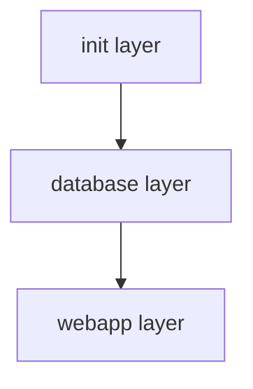

# Sample App Architecture

This repo has the following components to deploy the sample app using Symphony;

- [Official eShopOnWeb project](./apps/eShopOnWeb/)
- Sql Server Database
- [Symphony layers (Terraform modules) to deploy web app and database](./terraform/)
- [Tests written in golang to test symphony layers](./test)
- [DevContainer to develop symphony layers, also used in the CI/CD pipelines](./devcontainer)
- CI/CD pipelines

## DevContainer

[DevContainer configuration](./.devcontainer/devcontainer.json) uses [Dockerfile](./.devcontainer/Dockerfile) to build the _DevContainer_.

_DevContainer_ image is based on _Ubuntu:focal_ image and has the following packages installed;

- golang 1.15.6
- Terraform 0.14.2
- tflint
- tflint Azure Resource Manager ruleset
- direnv
- lucidity

_DevContainer_ also has the following _VS Code_ extensions installed to make the development experience better;

- HashiCorp.terraform
- mikestead.dotenv

Orchestrator that runs the pipelines uses the same _DevContainer_ to make development and pipeline experience same.

## Sample App

[Official eShopOnWeb project](https://github.com/dotnet-architecture/eShopOnWeb) is cloned into this repo ([./apps/eShopOnWeb](./apps/eShopOnWeb/) folder).

## Symphony Layers

There are three symphony layers to deploy the sample app;

- [Init layer](./terraform/01_init/)
- [Database layer](./terraform/02_sql/)
- [Web app layer](./terraform/03_webapp/)

### Layout of the symphony layers and deployments

### Init Layer

_01_init_ layer is a _special_ layer, that provisions the symphony infrastructure, for example, an Azure Storage Account to hold remote state of terraform modules.

### Database layer

_02_sql_ layer has only one deployment; _01_deployment_, that provisions the following resources for the sample app;

- Sql Server
- Sql Server database for catalogs
- Sql Server database for identities
- Sql Server firewall rule

### WebApp layer

_03_webapp_ layer has only one deployment; _01_deployment_, that provisions the following resources for the sample app.

- App Service plan
- App Service
