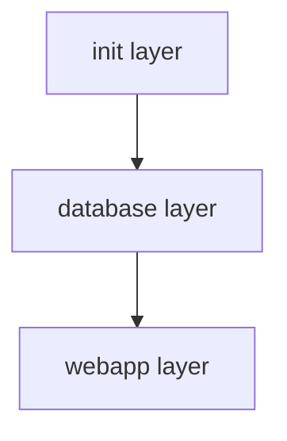

# Sample App Architecture

This repo has the following components to deploy the sample app using Symphony;

- [Official eShopOnWeb project](./apps/eShopOnWeb/)
- Sql Server Database
- [Symphony layers (Terraform modules) to deploy web app and database](./terraform/)
- [Tests written in golang to test symphony layers](./test)
- [DevContainer to develop symphony layers, also used in the CI/CD pipelines](./devcontainer)

## DevContainer

[DevContainer configuration](./.devcontainer/devcontainer.json) uses [Dockerfile](./.devcontainer/Dockerfile) to build the _DevContainer_.

_DevContainer_ image is based on _Ubuntu:focal_ image and has the following packages installed;

- golang 1.15.6
- Terraform 0.14.2
- tflint
- tflint Azure Resource Manager ruleset
- direnv
- lucidity

_DevContainer_ also has the following _VS Code_ extensions installed to make the development experience better;

- HashiCorp.terraform
- mikestead.dotenv

Orchestrator that runs the pipelines uses the same _DevContainer_ to make development and pipeline experience same.

## Sample App Design Decisions

Following decisions were made for the sample project:

- Sample project should be a simple project that can be used to learn Symphony
- Sample project should have at least 2 layers, each with at least 1 deployment
- Sample project should be easy to deploy and use
- Sample project source code should not be in the `symphony` repo

## Sample App

Most recent version of the [eShopOnWeb project](https://github.com/dotnet-architecture/eShopOnWeb) is published to _`TBD`_ and used as the sample app.

## Symphony Layers

There are three symphony layers to deploy the sample app;

- [Init layer](./terraform/01_init/)
- [Database layer](./terraform/02_sql/)
- [Web app layer](./terraform/03_webapp/)

### Layout of the symphony layers and deployments



### Init Layer

_01_init_ layer is a _special_ layer, that provisions the symphony infrastructure, for example, an _Azure Storage Account_ to hold remote state of terraform modules.

- Storage Account
  - Storage Container
- Storage Account for backup

### Database layer

_02_sql_ layer has only one deployment; _01_deployment_, that provisions the following resources for the sample app;

- Sql Server
- Sql Server database for catalogs
- Sql Server database for identities
- Sql Server firewall rule

### WebApp layer

_03_webapp_ layer has only one deployment; _01_deployment_, that provisions the following resources for the sample app.

- App Service plan
  - App Service

## Deployment

To have a successfull deployment, following guideline is suggested;

First, the init layer should be deployed. Modify the below command as needed and run it in the [01_init](./terraform/01_init/) folder to deploy the init layer;

```bash
terraform init -upgrade

location="westus"
project_name="<UNIQUE_PROJECT_NAME>"
environment="dev"
environment_version="1.0.0"
resource_group_name="rg-tf-remote-state-${environment}"
storage_account_name="tfrs${project_name}${environment}"
storage_account_tier="Standard"
storage_account_kind="StorageV2"
storage_account_replication_type="LRS"
identity_type="SystemAssigned"
container_name="tfstate"
backup_resource_group_name="rg-tf-remote-state-${environment}-bak"
backup_storage_account_name="tfrs${project_name}${environment}bak"

terraform plan \
  -var "location=${location}" \
  -var "container_name=${container_name}" \
  -var "environment=${environment}" \
  -var "environment_version=${environment_version}" \
  -var "resource_group_name=${resource_group_name}" \
  -var "storage_account_name=${storage_account_name}" \
  -var "storage_account_tier=${storage_account_tier}" \
  -var "storage_account_kind=${storage_account_kind}" \
  -var "storage_account_replication_type=${storage_account_replication_type}" \
  -var "identity_type=${identity_type}" \
  -var "backup_resource_group_name=${backup_resource_group_name}" \
  -var "backup_storage_account_name=${backup_storage_account_name}" \
  -out "${environment}.tfplan"

  terraform apply "${environment}.tfplan"
```

When the init layer resources are provisioned, run the following command to save some of the important values to a common file to use them on the later layers and deployments;

```bash
cat > ../backend.tfvars <<EOL
resource_group_name = "${resource_group_name}"
storage_account_name = "${storage_account_name}"
container_name = "${container_name}"
key = "terraform.tfstate"
EOL
```
