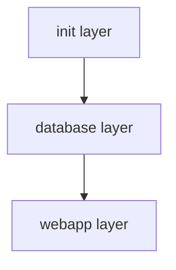

# Sample App Architecture

## Sample App

[Official eShopOnWeb project](https://github.com/dotnet-architecture/eShopOnWeb) is cloned into this repo ([./apps/eShopOnWeb](./apps/eShopOnWeb/) folder).

## Symphony Layers

There are three symphony layers to deploy the sample app;

- [Init layer](./terraform/01_init/)
- [Database layer](./terraform/02_sql/)
- [Web app layer](./terraform/03_webapp/)

### Layout of the symphony layers and deployments

### Init Layer

_01_init_ layer is a _special_ layer, that provisions the symphony infrastructure, for example, an _Azure Storage Account_ to hold remote state of terraform modules.

- Storage Account
  - Storage Container
- Storage Account for backup

### Database layer

_02_sql_ layer has only one deployment; _01_deployment_, that provisions the following resources for the sample app;

- Sql Server
- Sql Server database for catalogs
- Sql Server database for identities
- Sql Server firewall rule

### WebApp layer

_03_webapp_ layer has only one deployment; _01_deployment_, that provisions the following resources for the sample app.

- App Service plan
  - App Service
