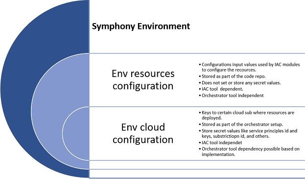

# Symphony Environment Considerations

In Symphony, an environment is defined by a set of configuration files that specify the input values for IAC modules and credentials required to authenticate to the relevant cloud environment where resources will be deployed for your subscription.

IAC module resources might need different configuration values based on the environment it is targeting. Resource configurations used for development purposes may be substantially different when compared to what is required to operate a production environment. Symphony supports the storage of multiple resource configurations per environment in files as part of the code repo. This also provides traceability because configuration changes can be tracked in your source control tool.

## Environment resources configurations

Environment resources configurations are files that store input values used by IAC modules to configure the resources that are provisioned. There are different file formats to consider based on the IAC tool used as depicted in the table below:

| **Infrastructure as Code Tool** | **Config file options** |
|---------------------------------|-------------------------|
| Terraform                       | *.tfvars or*.json       |
| Bicep                           | *.json                  |
| Arm                             | *.json                  |

Based on the above, it is quite common for teams that need to support multiple IAC tools to standardize the **JSON** format across projects. Thus a common format for all could be using JSON files to pass the input values to all.

## Environment cloud configurations

Environment cloud configurations are used to authenticate to a subscription in the cloud environment targeted for resource deployment. Those environment configurations are stored and configured at the orchestrator tool level so that they can be readily used by the IAC CI/CD pipelines used for resource deployments.

### Implementations options

There are multiple options to consider when storing the environment cloud configurations. While values can be stored as service connections and secrets in the orchestrator tool directly, they can also be stored in a central Azure key vault, which pipelines can be configured to have access to.

| **Option**                 | **Azure Key vault**                                                                                                                                              | **Orchestrators Secrets/SVC**                                                              |
|----------------------------|------------------------------------------------------------------------------------------------------------------------------------------------------------------|--------------------------------------------------------------------------------------------|
| **Implementation details** | Central key vault contains secrets representing each env needed keys, sp, and ids                                                                                | Collection of secrets/config per env stored in the orchestrator tool                       |
| **Pro(s)**                 | - Central storage for all env secrets, easier to maintain, rotate and recover in case of leak or breach. - No Credentials stored at the orchestrator tools. | - No added cost.                                                                           |
| **Con(s)**                 | - Added cost.                                                                                                                                                    | - Lists of secrets permanently stored in orchestrators are harder to maintain, and rotate. |

Symphony uses an Azure Key Vault to store the credentials needed to access the target environment Azure subscription. The Symphony Key Vault is created as a step when you execute `symphony provision` command and the required credentials are stored as Key Vault Secrets as part of the same process as well. Pipelines access the Key Vault to read the environment subscription credentials and use them to run the deployments of the IaC code through a service connection/GitHub secret that has read access to the Symphony Key Vault. These service connection/GitHub secrets are created a step when you execute `symphony pipeline config` command.

## Adding a new environment

To add a new environment to Symphony, you need to add the configurations JSON files representing that environment in the code repo and add the needed cloud subscription details/secrets to the orchestrator tool. Navigate to the **env** directory in the repo and create a new folder under either the Bicep or Terraform directory ( choice dependent ) for your new environment.
