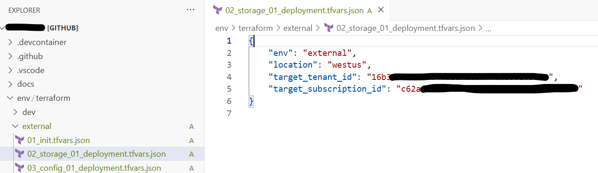
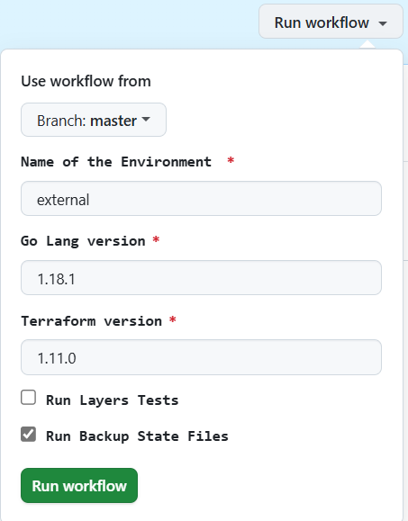
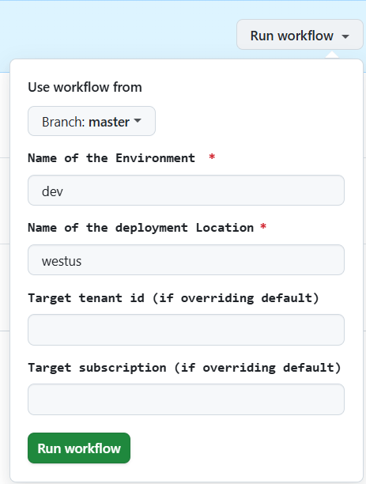
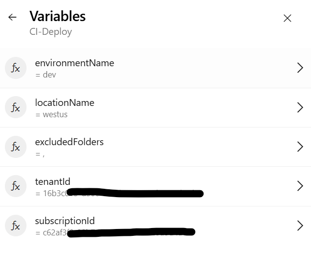

# Multi-tenant Deployments

## Setup

Deployments can only be made across tenant boundaries if the application backing our orchestrator is registered with the ability to operate in multiple tenants (i.e., with a multi-tenant audience).


### Create the MT application

Run the below script which will create a new multi-tenant app registration in Entra ID. You should do this while logged into the Entra ID tenant where you'd like your app to be homed.

```bash
application_id=$(az ad app create --display-name "symphony-conductor" --sign-in-audience AzureADMultipleOrgs | jq -r '.appId')
echo "Application Id = $application_id"
```

Make a note of the applicationId (== clientId); you'll need this when configuring any tenants targeted for deployments.


### Authorize the app to perform deployments

Before the application has permission to do anything in a target tenant, including its home tenant, you must first provision a service principal for it there and grant it the required access.

You can do this by logging into the target tenant with the AZ CLI and running the following bash script:

```bash
application_id="__REPLACE_ME__"
subscription_id="__REPLACE_ME__"

sp_oid=$(az ad sp create --id $application_id | jq -r '.id')

az role assignment create --assignee-object-id $sp_oid --assignee-principal-type ServicePrincipal --role "Owner" --scope "/subscriptions/$subscription_id"
```

If you need an environment in which to quickly run this, consider opening a Cloud Shell (bash) in the Azure Portal while logged into the tenant.


### Configure Symphony to use the app

Run `symphony provision` as you normally would, but when asked if Symphony should create a service principal for you, say no.

You'll be prompted for details of your own SP: enter the subscriptionId, the tenantId in which you registered the SP, and the resulting applicationId.

When you're finished provisioning, bootstrap one or more new repos using the familiar `symphony pipeline config <azdo|github> <terraform|bicep>` command.


## Deploying to another tenant

### Cross-tenant deployments via Terraform

Once you provision a new Terraform-based repo, you can get started with cross tenant deployments by creating a new environment and populating the `target_tenant_id` and `target_subscription_id` variables.

For example, copy the entire prod environment folder to a new environment named external. Then update all the *.tfvars.json files in that environment: change the value of the existing `env` to `external`, then add `target_tenant_id` and `target_subscription_id` variables with appropriate values for the tenant + subscription combination you'd like this environment to represent.

If values for these parameters are not provided, the environment will be deployed to the default tenant/subscription.






### Cross-tenant deployments via Bicep

(TODO): Ideally, Bicep deployments will read deployment target information (tenantId + subscriptionId) from a file specific to an environment, similar to how the setup for Terraform works.

Today, no modifications are made to the environment's config. Instead, deployment target information is specified as parameters at pipeline/workflow runtime.

If values for these parameters are not explicitly set, the environment will be deployed to the default tenant/subscription.

#### GitHub


#### AzDO

