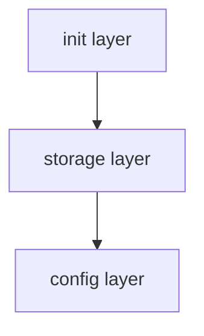
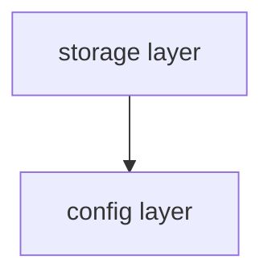

# Sample App Architecture

This repo has the following components to deploy the sample app using Symphony:

- [Storage Account](https://azure.microsoft.com/en-us/products/storage/blobs/)
- [App Configuration](https://azure.microsoft.com/en-us/products/app-configuration/)
- [Symphony layers (Terraform or Bicep) to deploy a Storage account and an App Configuration service](./../IAC/)
- Tests to perform tests for symphony layers
  - [golang (Terraform)](./../IAC/Terraform/test)
  - [Pester (Bicep)](./../IAC/Bicep/test)
- [DevContainer to develop Symphony](DEVELOPER_EXPERIENCE.md)

## Symphony Layers (Terraform)

There are three Symphony layers to deploy the Sample App;

- [Init layer](./../IAC/Terraform/terraform/01_init)
- [Storage layer](./../IAC/Terraform/terraform/02_storage)
- [Config layer](./../IAC/Terraform/terraform/03_config)

### Layout of the symphony layers and deployments (Terraform)

### Init Layer (Terraform)

_01_init_ layer is a _special_ layer, that provisions the symphony infrastructure, for example, an _Azure Storage Account_ to hold remote state of terraform modules.

- Storage Account
  - Storage Container
- Storage Account for backup

### Storage layer (Terraform)

_02_storage_ layer has only one deployment: _01_deployment_, which provisions the following resources:

- Storage Account

### Config layer (Terraform)

_03_config_ layer has only one deployment: _01_deployment_, which provisions the following resources:

- App Configuration

## Symphony Layers (Bicep)

There are two Symphony layers to deploy the Sample App

- [Storage layer](./../IAC/Bicep/bicep/01_storage)
- [Config layer](./../IAC/Bicep/bicep/02_config)

### Layout of the symphony layers and deployments (Bicep)

### Database layer (Bicep)

_01_storage_ layer has two deployments:

- _01_rg_, that provisions resource group
- _02_deployment_, which provisions the following resources:
  - Storage Account

### Config layer (Bicep)

_02_config_ layer has two deployments:

- _01_rg_, that provisions resource group
- _02_deployment_, which provisions the following resources:
  - App configuration
