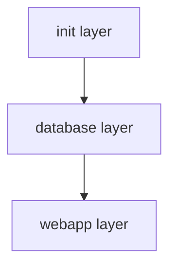
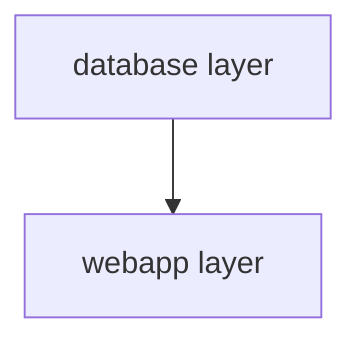

# Sample App Architecture

This repo has the following components to deploy the sample app using Symphony:

- [Official eShopOnWeb project](https://github.com/dotnet-architecture/eShopOnWeb)
- [Azure SQL Database](https://azure.microsoft.com/en-us/products/azure-sql/database)
- [Symphony layers (Terraform or Bicep) to deploy web app and database](./../IAC/)
- Tests to perform tests for symphony layers
  - [golang (Terraform)](./../IAC/Terraform/test)
  - [ShellSpec (Bicep)](./../IAC/Bicep/test)
- [DevContainer to develop Symphony](DEVELOPER_EXPERIENCE.md)

## Symphony Layers (Terraform)

There are three Symphony layers to deploy the Sample App;

- [Init layer](./../IAC/Terraform/terraform/01_init)
- [Database layer](./../IAC/Terraform/terraform/02_sql)
- [Web App layer](./../IAC/Terraform/terraform/03_webapp)

### Layout of the symphony layers and deployments (Terraform)

### Init Layer (Terraform)

_01_init_ layer is a _special_ layer, that provisions the symphony infrastructure, for example, an _Azure Storage Account_ to hold remote state of terraform modules.

- Storage Account
  - Storage Container
- Storage Account for backup

### Database layer (Terraform)

_02_sql_ layer has only one deployment: _01_deployment_, which provisions the following resources for the sample app:

- SQL Server
- SQL Server database for catalogs
- SQL Server database for identities
- SQL Server firewall rule

### WebApp layer (Terraform)

_03_webapp_ layer has only one deployment: _01_deployment_, which provisions the following resources for the sample app.

- App Service plan
  - Web App for Containers

## Symphony Layers (Bicep)

There are two Symphony layers to deploy the Sample App

- [Database layer](./../IAC/Bicep/bicep/01_sql)
- [Web App layer](./../IAC/Bicep/bicep/02_webapp)

### Layout of the symphony layers and deployments (Bicep)

### Database layer (Bicep)

_01_sql_ layer has two deployments:

- _01_rg_, that provisions resource group
- _02_deployment_, which provisions the following resources:
  - SQL Server
  - SQL Server database for catalogs
  - SQL Server database for identities
  - SQL Server firewall rule

### WebApp layer (Bicep)

_02_webapp_ layer has two deployments:

- _01_rg_, that provisions resource group
- _02_deployment_, which provisions the following resources:
  - App Service plan
    - Web App for Containers
