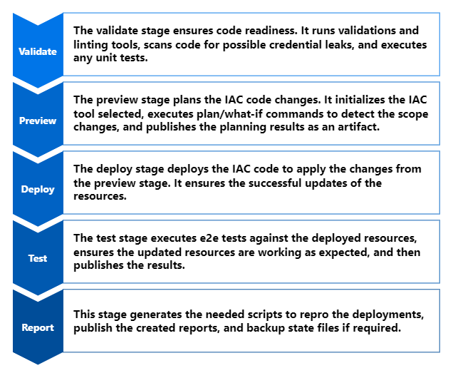
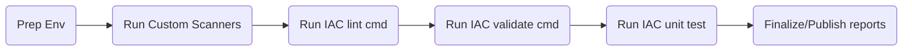
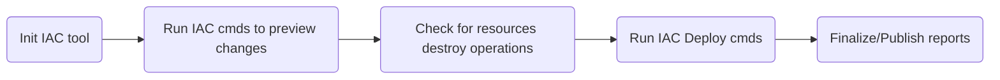
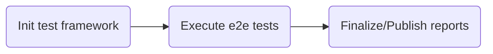
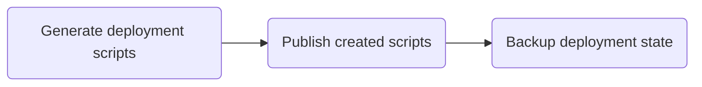
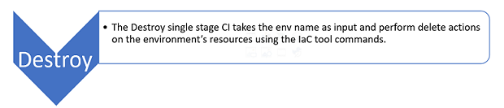
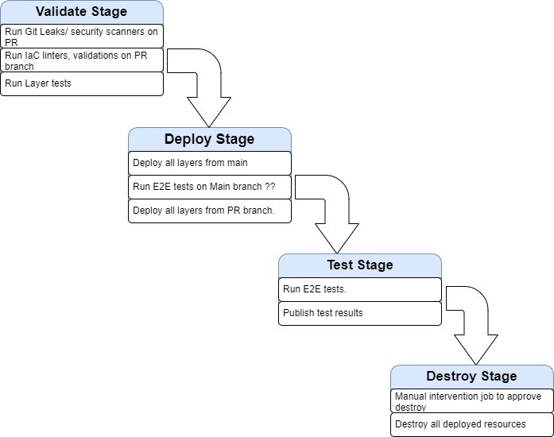

# Orchestrators workflow

Creating pipelines for Infrastructure as code seems easy to build task, but in a mature system, things can get complicated as it needs to handle many changing dynamics parts. A mature workflow for IAC not only automates the deployment of the IAC resources but also incorporates engineering fundamentals, resources validation, dependency management, test execution, security scanning, and more.

Symphony offers multiple workflows to ensure engineering excellence at every stage of the IaC process. The workflows are designed to be orchestrator independent by relying on the logic implemented in bash scripts and the pipelines being thin shim layers that execute the logic scripts. This design makes it easy to update the workflows or port on new tools regardless of the SCM by adding those tools to the [workflow scripts](./../scripts/orchestrators/).

## Main Deploy Workflow

This is the CI workflow to deploy the IaC resources to the target environment and subscription. It ensures best practices in IAC code repos, through multi-stage tasks to vet, deploy, test, all needed resources, and report any failures. Note that the details of stage execution may vary based on features available on the orchestrator's IAC tool.

This workflow has a set of inputs variable that can be updated at the execution time. While the inputs could vary based on the selected IaC tool, one common input variable across all is the **environment name**, which defines what environment configurations to be used.

### Validate

This stage ensures code readiness. It executes pre_validate events, runs validations and linting tools, scans code for possible cred leaks, and executes any unit tests. Stage steps are executed in the following sequential order.

### Preview & Deploy

This stage plans the execution of the IAC code and estimates the scope of the changes. It initializes the IAC tool selected, runs plan/what-if commands to detect the changing scope, executes pre_deploy events, then runs deploy commands to update the resources, executes post_deploy events, and eventually ensures successful resource updates.

### Test

This stage executes the integration or end-to-end tests against the recently deployed/updated resources to ensure the configurations/changes are reflected and resources are working as expected. It then publishes the results of the tests and drops them as artifacts for future reference.

### Report

This stage generates the needed scripts to repro the deployments, publish the created reports, and backup state files if required.

## Destroy workflow

This is a single-stage workflow to destroy the deployed IaC resources of an environment and report any failures for easier cost and resource management. Note that the details of stage execution may vary based on features available on the orchestrator's IAC tool.

This workflow has a set of inputs variable that can be updated at the execution time. While the inputs could vary based on the selected IaC tool, one common input variable across all is the **environment name**, which defines what environment configurations to be used.

## Pull Request Workflow (currently for GitHub only)

This is a feature that helps ensuring best practices in IAC code repos when development is in progress, Pull Request workflow offers a set of validations to vet the pull request branch code changes as part of the review process. This will ensure changes of the IaC have not only been validated at the code quality level but also been properly tested on a real deployed environment to see the impact of resource changes.

## Workflow tools

Symphony workflows use a set of tools to run tasks at each stage. Those tools are automatically installed and configured by the workflow tasks as needed on the SCM agent during the execution of the workflow tasks.

- [Azure CLI](https://learn.microsoft.com/en-us/cli/azure/install-azure-cli) is used to authenticate to the targeted environment Azure subscription. Here is a script to locally [install](../scripts/orchestrators/setup-azcli.sh) it.
- [Gitleaks](https://github.com/zricethezav/gitleaks) is used to scan and prevent secrets from getting leaked into the main branch. Here is a script to locally [install](../scripts/orchestrators/setup-gitleaks.sh) it. Some alternatives to Gitleaks are, [Aqua Vulnerability Scanning and Management](https://www.aquasec.com/products/container-vulnerability-scanning/), [GitHub Code Scanning](https://docs.github.com/en/code-security/code-scanning/automatically-scanning-your-code-for-vulnerabilities-and-errors/about-code-scanning), [Mend SAST](https://www.mend.io/sast/), [Oxeye](https://www.oxeye.io/solutions/appsec-devsecops), [Sonar Cloud](https://www.sonarsource.com/products/sonarcloud/features/)

### Bicep workflow tools

- [Bicep](https://learn.microsoft.com/azure/azure-resource-manager/bicep/overview?tabs=bicep) is used to deploy the Bicep IaC modules. Here is a script to [auto-install](../scripts/orchestrators/setup-bicep.sh) it.
- [Powershell Core](https://learn.microsoft.com/en-us/powershell/scripting/install/installing-powershell?view=powershell-7.2) is used to execute PowerShell scripts, like [ARM-TTK](https://github.com/Azure/arm-ttk) scripts. Here is a script to [auto-install](../scripts/orchestrators/setup-powershell.sh) it.
- [ARM-TTK](https://github.com/Azure/arm-ttk) is used to validate ARM templates. Here is a script to [auto-install](../scripts/orchestrators/setup-armttk.sh) it.
- [Shellspec](https://shellspec.info/) is used to write and execute tests to test Bicep modules. Here is a script to [auto-install](../scripts/orchestrators/setup-shellspec.sh) it.
- [Pester](https://pester.dev/) is used to write and execute tests to test Bicep modules. Here is a script to [auto-install](../scripts/orchestrators/setup-pester.sh) it.

### Terraform workflow tools

- [Terraform](https://developer.hashicorp.com/terraform/intro) is used to deploy IaC modules resources. Here is a script to [auto-install](../scripts/orchestrators/setup-terraform.sh) it.
- [TFLint](https://github.com/terraform-linters/tflint) is used to validate the Terraform modules code. Here is a script to [auto-install](../scripts/orchestrators/setup-tflint.sh) it.
- [Go](https://go.dev/learn/) is used to write and execute tests for the terraform modules code using [Terratest](https://terratest.gruntwork.io/). Here is a script to [auto-install](../scripts/orchestrators/setup-go.sh) it.
