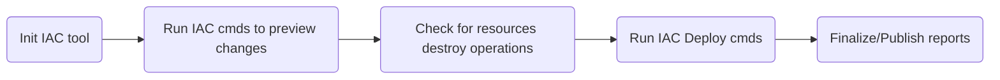
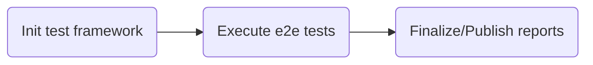
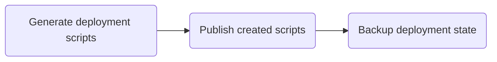

# Orchestrates workflow

Creating pipelines for Infrastructure as code seems easy to build task, but in a mature system, things can get complicated as it needs to handle many changing dynamics parts. A mature workflow for IAC not only automates the deployment of the IAC resources but also incorporates engineering fundamentals, resources validation, dependency management, test execution, security scanning, and more.

## Main Workflow steps

To ensure best practices in IAC code repos, pipeline workflows need to handle a set of validations on any code change. Note that the details of stages execution may vary based on features available on the orchestrator's IAC tool.

### Validate

This stage ensures code readiness. It runs validations and linting tools, scans code for possible cred leaks, and executes any unit tests. Stage steps are executed in the following sequential order.

### Preview & Deploy

This stage plans the execution of the IAC code and estimates the scope of the changes. It initializes the IAC tool selected, runs plan/what-if commands to detect the changing scope, then runs deploy commands to update the resources, and ensures successful resource updates.

### Test

This stage executes the integration or end-to-end tests against the recent deployed/updated resources to ensure the configurations/changes are reflected and resources are working as expected. It then publishes the results of the tests and drops them as artifacts for future references.

### Report

This stage generates the needed scripts to repro the deployments, publish the created reports, and backup state files if required.

## Pull Request Workflow steps

To ensure best practices in IAC code repos when development is in progress, Pull Request workflow handle a set of validations the pull request branch to test any code change. Note that the details of stages execution may vary based on features available on the orchestrator's IAC tool.

## Required tools

To run the workflows, you need to have the following installed on agents

### Bicep Pipelines

- [Azure CLI](https://learn.microsoft.com/en-us/cli/azure/install-azure-cli) here is a script to auto [install](../scripts/orchestrators/setup-azcli.sh) it.
- [Gitleaks](https://github.com/zricethezav/gitleaks) here is a script to auto [install](../scripts/orchestrators/setup-gitleaks.sh) it.
- [Powershell Core](https://learn.microsoft.com/en-us/powershell/scripting/install/installing-powershell?view=powershell-7.2) here is a script to auto [install](../scripts/orchestrators/setup-powershell.sh) it.
- [ARM-TTK](https://github.com/Azure/arm-ttk) here is a script to auto [install](../scripts/orchestrators/setup-armttk.sh) it.
- [Shellspec](https://shellspec.info/) here is a script to auto [install](../scripts/orchestrators/setup-shellspec.sh) it.
- [Pester](https://pester.dev/) here is a script to auto [install](../scripts/orchestrators/setup-pester.sh) it.

### Terraform Pipelines

- [Azure CLI](https://learn.microsoft.com/en-us/cli/azure/install-azure-cli) here is a script to auto [install](../scripts/orchestrators/setup-azcli.sh) it.
- [Gitleaks](https://github.com/zricethezav/gitleaks) here is a script to auto [install](../scripts/orchestrators/setup-gitleaks.sh) it.
- [Terraform](https://www.terraform.io/downloads) here is a script to auto [install](../scripts/orchestrators/setup-terraform.sh) it.
- [TFLint](https://github.com/terraform-linters/tflint) here is a script to auto [install](../scripts/orchestrators/setup-tflint.sh) it.
- [Go](https://go.dev/learn/) here is a script to auto [install](../scripts/orchestrators/setup-go.sh) it.