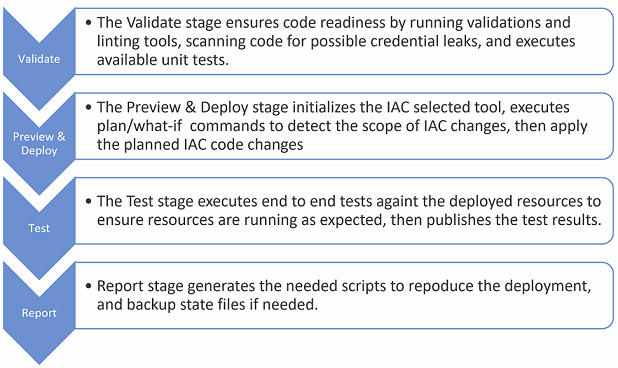
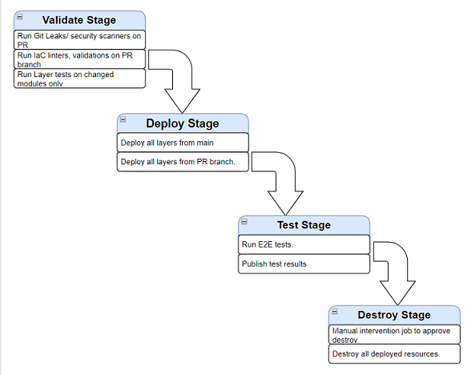

# Orchestrates workflow

Creating pipelines for Infrastructure as code seems easy to build task, but in a mature system, things can get complicated as it needs to handle many changing dynamics parts. A mature workflow for IAC not only automates the deployment of the IAC resources but also incorporates engineering fundamentals, resources validation, dependency management, test execution, security scanning, and more.

## Main Workflow steps

To ensure best practices in IAC code repos, pipeline workflows need to handle a set of validations on any code change. Note that the details of stages execution may vary based on features available on the orchestrator's IAC tool.

### Validate

This stage ensures code readiness. It runs validations and linting tools, scans code for possible cred leaks, and executes any unit tests. Stage steps are executed in the following sequential order.

### Preview & Deploy

This stage plans the execution of the IAC code and estimates the scope of the changes. It initializes the IAC tool selected, runs plan/what-if commands to detect the changing scope, executes pre_deploy events, then runs deploy commands to update the resources, executes post_deploy events, and eventually ensures successful resource updates.

### Test

This stage executes the integration or end-to-end tests against the recent deployed/updated resources to ensure the configurations/changes are reflected and resources are working as expected. It then publishes the results of the tests and drops them as artifacts for future references.

### Report

This stage generates the needed scripts to repro the deployments, publish the created reports, and backup state files if required.

## Pull Request Workflow steps

To ensure best practices in IAC code repos when development is in progress, Pull Request workflow offers a set of validations to vet the pull request branch code changes as part of the review process. This will ensure changes of the IaC has not only been validated at code quality level, but also been properly tested on a real deployed environment to see the impact of resources changes.

## Required tools

To run the workflows, you need to have the following tools installed on agents

- [Azure CLI](https://learn.microsoft.com/en-us/cli/azure/install-azure-cli) here is a script to auto [install](../scripts/orchestrators/setup-azcli.sh) it.
  > Azure CLI is a command-line tool that provides a convenient way to manage Azure resources. It is available for Windows, macOS, and Linux. Azure CLI is a cross-platform tool that can be used to create and manage Azure resources from the command line or from scripts. Azure CLI is a great tool for automation and scripting. It is also a great tool for learning Azure services because it provides a consistent experience across all Azure services.

  Pipelines using Azure CLI to interact with Azure resources

- [Gitleaks](https://github.com/zricethezav/gitleaks) here is a script to auto [install](../scripts/orchestrators/setup-gitleaks.sh) it.

  > Gitleaks is a SAST tool for detecting hardcoded secrets like passwords, api keys, and tokens in git repos. Gitleaks is designed to be run on a git repo, and will iterate over the commit history, run regexes against the commit diffs, and report any hits.

  Pipelines using Gitleaks to scan for secrets in the code

  Some alternatives to Gitleaks are, [Aqua Vulnerability Scanning and Management](https://www.aquasec.com/products/container-vulnerability-scanning/), [GitHub Code Scanning](https://docs.github.com/en/code-security/code-scanning/automatically-scanning-your-code-for-vulnerabilities-and-errors/about-code-scanning), [Mend SAST](https://www.mend.io/sast/), [Oxeye](https://www.oxeye.io/solutions/appsec-devsecops), [Sonar Cloud](https://www.sonarsource.com/products/sonarcloud/features/)

### Tools specific to Bicep Pipelines

- [Powershell Core](https://learn.microsoft.com/en-us/powershell/scripting/install/installing-powershell?view=powershell-7.2) here is a script to auto [install](../scripts/orchestrators/setup-powershell.sh) it.

  > PowerShell is a task-based command-line shell and scripting language built on .NET. PowerShell helps system administrators and power users manage Windows and Linux/Unix environments. PowerShell provides a consistent management interface for Windows, Linux, and macOS. PowerShell is open source and cross-platform (Windows, Linux, and macOS).

  Pipelines using Powershell Core to execute powershell scripts, like [ARM-TTK](https://github.com/Azure/arm-ttk) scripts

- [ARM-TTK](https://github.com/Azure/arm-ttk) here is a script to auto [install](../scripts/orchestrators/setup-armttk.sh) it.

  > ARM Template Testing Kit (ARM-TTK) is a collection of tests to validate Azure Resource Manager (ARM) templates. ARM-TTK is a PowerShell module that can be used to validate ARM templates locally or in a CI/CD pipeline.

  Pipelines using ARM-TTK to validate ARM templates

- [Shellspec](https://shellspec.info/) here is a script to auto [install](../scripts/orchestrators/setup-shellspec.sh) it.

  > Shellspec is a BDD testing framework for shell scripts. It is a pure shell script implementation of RSpec, the Ruby BDD testing framework. Shellspec is a pure shell script implementation of RSpec, the Ruby BDD testing framework. Shellspec is a pure shell script implementation of RSpec, the Ruby BDD testing framework.

  Pipeline using Shellspec to validate shell scripts

- [Pester](https://pester.dev/) here is a script to auto [install](../scripts/orchestrators/setup-pester.sh) it.

  > Pester is a Behavior-Driven Development (BDD) based unit test runner for PowerShell. Pester provides a framework for running unit tests to execute and validate PowerShell commands. Pester follows a file naming convention for naming tests to be discovered by pester at test time and a simple set of functions that expose a Testing DSL for isolating, running, evaluating and reporting the results of PowerShell commands.

  Pipeline using Pester to validate powershell scripts

### Tools specific to Terraform Pipelines

- [Terraform](https://www.terraform.io/downloads) here is a script to auto [install](../scripts/orchestrators/setup-terraform.sh) it.

  > Terraform is an open-source infrastructure as code software tool that provides a consistent CLI workflow to manage hundreds of cloud services. Terraform codifies cloud APIs into declarative configuration files. Infrastructure is described using a high-level configuration syntax. This allows a blueprint of your datacenter to be versioned and treated as you would any other code. Additionally, infrastructure can be shared and re-used. Terraform can manage existing and popular service providers as well as custom in-house solutions.

  Pipelines using Terraform to deploy infrastructure

- [TFLint](https://github.com/terraform-linters/tflint) here is a script to auto [install](../scripts/orchestrators/setup-tflint.sh) it.

  > TFLint is a Terraform linter focused on possible errors, best practices, etc. It is designed for Terraform versions 0.12 and later. TFLint is a Terraform linter focused on possible errors, best practices, etc. It is designed for Terraform versions 0.12 and later. TFLint is a Terraform linter focused on possible errors, best practices, etc. It is designed for Terraform versions 0.12 and later.

  Pipelines using TFLint to validate Terraform code

- [Go](https://go.dev/learn/) here is a script to auto [install](../scripts/orchestrators/setup-go.sh) it.

  > Go is an open source programming language that makes it easy to build simple, reliable, and efficient software. Go is an open source programming language that makes it easy to build simple, reliable, and efficient software. Go is an open source programming language that makes it easy to build simple, reliable, and efficient software.

  Pipelines using Go to execute terratest test codes
