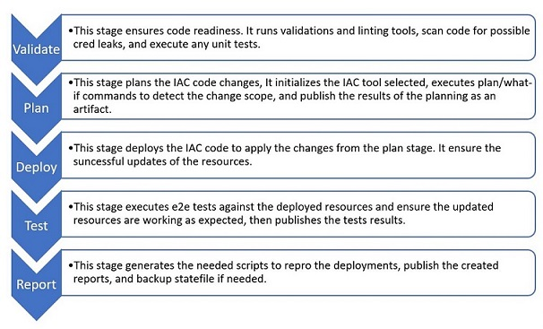
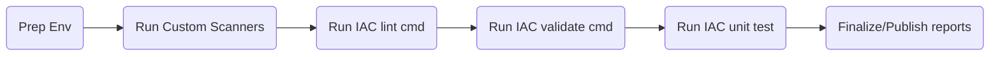
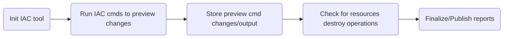
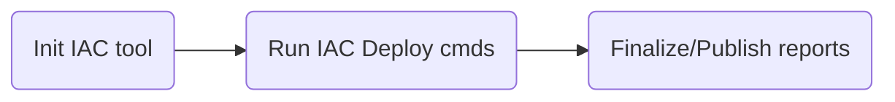
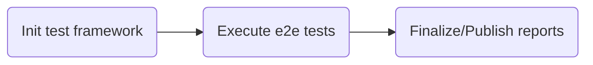
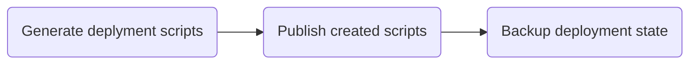

# Orchestraros workflow

Creating pipelines for Ifrasctructure as code while seems an easy to build task, but in mature system things can get complicated as it need to handle a lot of changing dynamics parts. A mature worfflow for IAC not only automate the deployment of the IAC resources, but also incorporates engineering fundamentals, resources validation, dependency management, test execution, security scanning, and more.

## workflow steps

To ensure best practices in IAC code repos, pipeline work flows need to handle a set of validations on any code change. Note that the details of stages execution may vary based on deatures availablity on the IAC tool the orchestrator used.

### Validate

This stage ensures code readiness. It runs validations and linting tools, scan code for possible cred leaks, and execute any unit tests. Satge steps are executed in the follwoing sequential order.

### Plan

this stage plans the execution of IAC code and estimated the scope of the chages. It initializes the IAC tool selected, run plan/what-if commands to detect the change scope, and publish the results of the planning as an artifact.

### Deploy

This stage deploys the IAC code to apply the changes from the plan stage. It initializes the IAC tool selected, run deploy cmds to update the resources, and ensure the successful updates of the resources.

### Test

This stage executes the integration or end to end tests against the recent deployed/updated resources to ensure the configurations/changes are reflected and resources are working as expected, it then publishes the tests results and drop them as artifacts for future references.

### Report

This stage generates the needed scripts to repro the deployments, publish the created reports, and backup statefile if needed.

